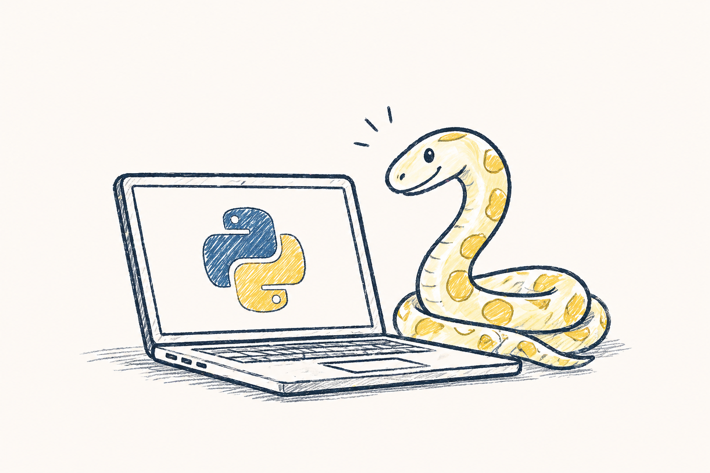

[](https://boisgera.github.io/python/)

# The Python course

<https://boisgera.github.io/python/>

# For developers & content editors

First [install bun] and then this project dependencies with `bun install`.

To preview and modify the contents of this project, execute
```bash
bun run dev
```
then edit the contents of the `src` folder to your liking.

To produce a set of files to be served statically, execute
```bash
bun run build
```
Your files are in the `dist` directory. 
Use `bunx serve dist` to visualize the result.

If you are into [Node.js], you can also use `npm` instead of `bun` and `npx` instead of `bunx`.

[install bun]: https://bun.com/docs/installation
[Node.js]: https://nodejs.org/en
